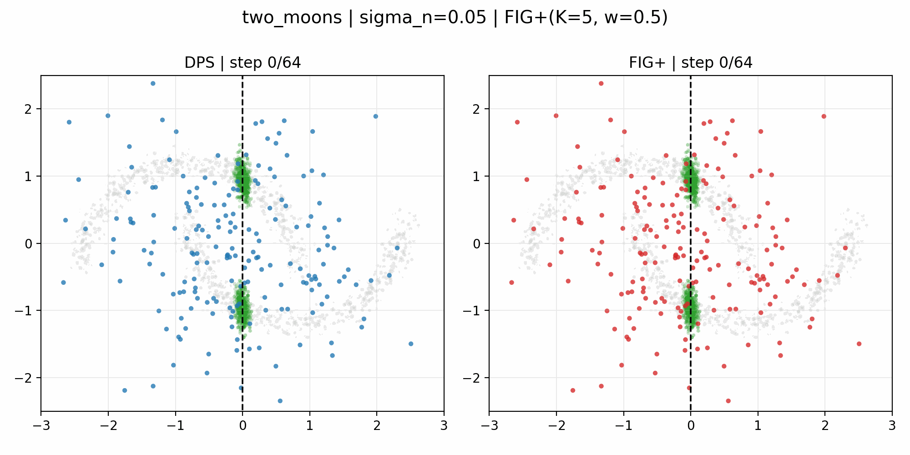
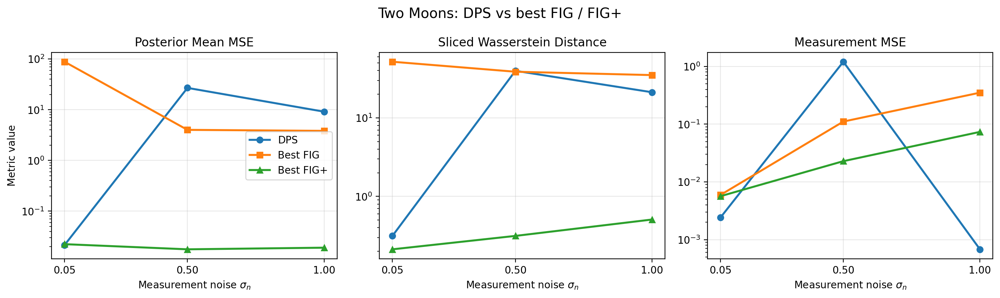
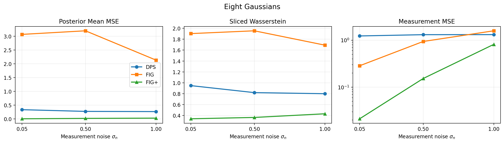

# A 2D Study of Diffusion Posterior Sampling (DPS) and FLOW WITH INTERPOLANT GUIDANCE FIG for Linear Inverse Problems

This folder contains the paper-style deliverable for a toy-2D extension of the original FIG repository.

The goal of this project is to study conditional diffusion samplers for linear inverse problems in a setting where the posterior geometry is fully visible. Instead of working directly in high-dimensional image space, we train compact DDPM priors on two synthetic 2D datasets and compare three conditional solvers:

- `DPS` (Diffusion Posterior Sampling)
- `FIG` (Flow with Interpolant Guidance)
- `FIG+` (FIG with a Tweedie-based mixing step for mask-like operators)

The FIG paper is available here: https://openreview.net/pdf?id=fs2Z2z3GRx

Our full report is available here:

- [`Report`](./Generative_models_for_images_report.pdf)

## What Is In This Study

We extend the original FIG codebase with a dedicated toy-2D pipeline:

- synthetic datasets: `Two-Moons` and `Eight-Gaussians`
- a DDPM prior trained from scratch with an MLP denoiser and sinusoidal time embedding
- a 1D noisy linear observation model
- modular implementations of `DPS`, `FIG`, and `FIG+`
- a reference posterior sampler built by importance reweighting
- quantitative evaluation with posterior mean MSE, sliced Wasserstein distance, and measurement MSE
- qualitative plots and denoising GIFs

The observation model is

$$
y = A x^\star + n, \qquad A = [1 \;\; 0], \qquad n \sim \mathcal{N}(0, \sigma_n^2)$$

This means that the first coordinate is observed and the second one is hidden. In this setting, the posterior remains non-Gaussian because the prior itself is non-Gaussian.

## Main Takeaways

- The toy-2D setting is extremely useful for interpreting inverse-problem samplers because the prior support, the observation line, and the conditional samples can all be visualized directly.
- `DPS` is a strong baseline and already recovers the posterior geometry reasonably well.
- Plain `FIG` is more sensitive to the operator structure and is weaker than the other methods on this mask-like task.
- `FIG+` is the strongest method overall in the reported experiments: it best preserves the hidden-coordinate structure while still enforcing the measurement.

In the compact benchmark reported in the paper, `FIG+` achieves the best posterior-quality metrics on both `Two-Moons` and `Eight-Gaussians`.

## Denoising Dynamics

The denoising animations are one of the most informative outputs of the project. They show how the conditional sample cloud evolves from the same noisy initialization under different samplers.

### DPS vs FIG+



### DPS vs FIG vs FIG+


The corresponding frame strips are also available:

- [`two_moons_sigma_0.05_dps_vs_fig_plus_strip.png`](./assets/readme/two_moons_sigma_0.05_dps_vs_fig_plus_strip.png)
- [`two_moons_sigma_0.05_dps_vs_fig_fixed_vs_fig_plus_strip.png`](./assets/readme/two_moons_sigma_0.05_dps_vs_fig_fixed_vs_fig_plus_strip.png)

## Quantitative Trends

### Two-Moons



### Eight-Gaussians




## File Structure

- [`toy_2d_outputs/paper_style/FIG_DPS_Toy2D_Paper.tex`](./toy_2d_outputs/paper_style/FIG_DPS_Toy2D_Paper.tex): paper-style LaTeX report
- [`toy_2d_outputs/paper_style/build_paper.sh`](./toy_2d_outputs/paper_style/build_paper.sh): build script for the LaTeX paper
- [`toy_2d_outputs/paper_style/report_assets/`](./toy_2d_outputs/paper_style/report_assets): figures used in the paper
- [`toy_2d_outputs/paper_style/report_assets/qualitative/`](./toy_2d_outputs/paper_style/report_assets/qualitative): qualitative DPS vs FIG+ comparison plots
- [`toy_2d_outputs/paper_style/animations/`](./toy_2d_outputs/paper_style/animations): denoising GIFs and representative frame strips
- [`toy_2d_outputs/paper_style/corrected_best_summary.csv`](./toy_2d_outputs/paper_style/corrected_best_summary.csv): compact summary of the best configurations
- [`toy_2d_outputs/paper_style/corrected_best_summary.md`](./toy_2d_outputs/paper_style/corrected_best_summary.md): markdown version of the summary table

## Build

If a LaTeX engine is available on your machine, the paper can be compiled with:

```bash
cd toy_2d_outputs/paper_style
bash build_paper.sh
```

If `latexmk` is installed, it will be used automatically. Otherwise the script falls back to `pdflatex`.

## Summary

This project turns the original FIG repository into a small but interpretable benchmark for conditional diffusion on inverse problems. The resulting experiments show that low-dimensional toy settings are not just pedagogical: they reveal the geometry of posterior sampling directly and make the behavior of `DPS`, `FIG`, and `FIG+` much easier to understand than in image space alone.
