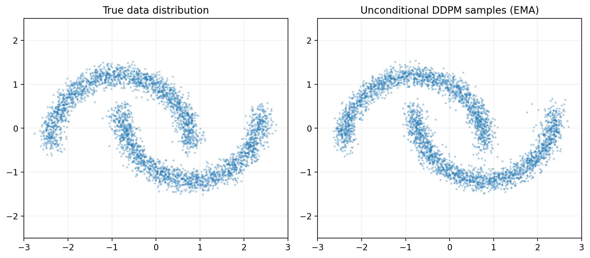
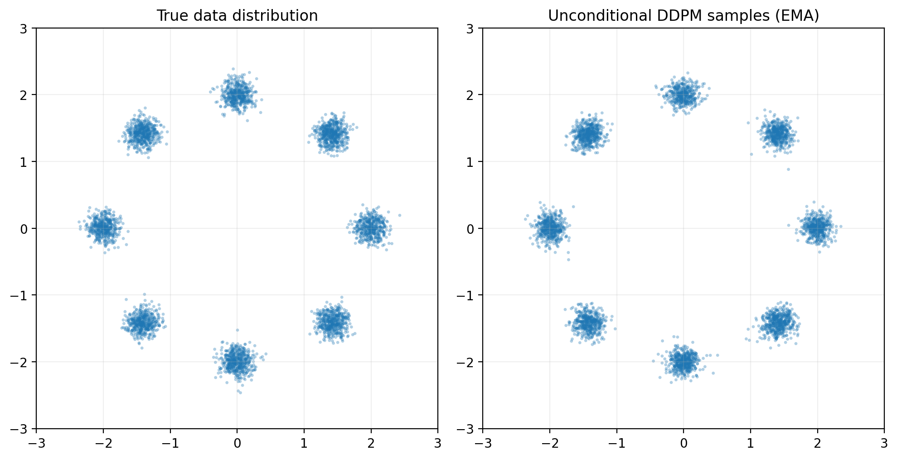
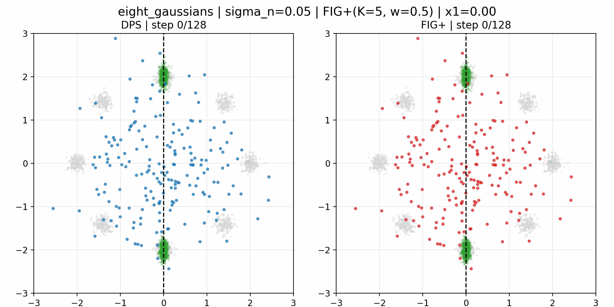

# A Toy-2D Study of DPS, FIG, and FIG+ for Linear Inverse Problems

This repository extends the original FIG codebase with a dedicated toy-2D benchmark for studying conditional diffusion samplers on linear inverse problems.

The main goal is to make posterior geometry fully visible. Instead of working directly in image space, we train DDPM priors on two synthetic 2D datasets and compare:

- `DPS` (Diffusion Posterior Sampling)
- `FIG` (Flow with Interpolant Guidance)
- `FIG+` (FIG with a Tweedie-based hidden-component mixing step)

## Denoising Dynamics At A Glance

The animation below is the most informative qualitative result of the project. It shows a fixed-line inpainting experiment on `Two-Moons` with observation line `x1 = 0`.


How to read this GIF:

- the sample cloud starts from a random Gaussian initialization
- the **gray** points are the support of the true prior distribution (`Two-Moons`)
- the **dashed vertical line** is the observation constraint `x1 = 0`
- the **green** points are a reference approximation of the true posterior `p(x | y)`
- the **blue** points are the current samples produced by `DPS`
- the **red** points are the current samples produced by `FIG+`

What the animation is meant to show:

- we observe only `x1`, not `x2`
- the solver must therefore reconstruct the plausible distribution of the hidden coordinate `x2`
- since the prior is `Two-Moons`, the correct posterior is not “the whole line `x1 = 0`”
- it is only the part of that line that intersects plausible regions of the prior
- here, that posterior is bimodal, so a good solver must move the cloud toward the two correct modes on the line

This is why the GIF is useful: it shows not only where the methods end, but how they reshape the cloud during denoising.

The original FIG paper is available on OpenReview:

- [Flow with Interpolant Guidance](https://openreview.net/pdf?id=fs2Z2z3GRx)

The up-to-date paper-style report for this repository is:

- [`toy_2d_outputs/paper_style/FIG_DPS_Toy2D_Paper.tex`](./toy_2d_outputs/paper_style/FIG_DPS_Toy2D_Paper.tex)
- [`toy_2d_outputs/paper_style/build_paper.sh`](./toy_2d_outputs/paper_style/build_paper.sh)

The repository also contains a compiled PDF deliverable, but the LaTeX source above is the authoritative up-to-date version:

- [`Generative_models_for_images_report.pdf`](./Generative_models_for_images_report.pdf)

## Overview

This toy benchmark was built to answer a very simple question:

> when the observation operator hides part of the state, which conditional sampler actually reconstructs the correct posterior distribution?

The core experiment is:

- learn an unconditional diffusion prior on `Two-Moons` or `Eight-Gaussians`
- define a noisy linear observation `y = A x* + n`
- use the learned prior to solve the inverse problem with `DPS`, `FIG`, and `FIG+`
- compare the generated conditional samples to a reference posterior that can be approximated directly in 2D

Because everything happens in two dimensions, we can visualize:

- the true data distribution
- the learned prior
- the observation line
- the reference posterior
- the denoising trajectory of each solver

That is the main reason this benchmark is useful: it makes posterior sampling interpretable instead of purely numerical.

## What Was Added Beyond the Original FIG Repository

The original repository focuses on image restoration with pretrained priors. This extension adds a fully separate toy-2D experimental stack:

- toy data generators for `two_moons` and `eight_gaussians`
- a DDPM training pipeline from scratch
- a stronger residual, time-conditioned denoiser for 2D priors
- EMA checkpointing for cleaner sampling
- a linear inverse-problem module with Gaussian measurement noise
- toy implementations of `DPS`, `FIG`, and `FIG+`
- a reference posterior sampler based on importance reweighting
- benchmark scripts, quantitative summaries, static plots, and denoising GIFs

The key code lives in:

- [`toy_2d/datasets.py`](./toy_2d/datasets.py)
- [`toy_2d/model.py`](./toy_2d/model.py)
- [`toy_2d/diffusion.py`](./toy_2d/diffusion.py)
- [`toy_2d/trainer.py`](./toy_2d/trainer.py)
- [`toy_2d/train.py`](./toy_2d/train.py)
- [`toy_2d/inverse_problem.py`](./toy_2d/inverse_problem.py)
- [`toy_2d/solvers.py`](./toy_2d/solvers.py)
- [`toy_2d/benchmark.py`](./toy_2d/benchmark.py)
- [`toy_2d/make_denoising_gif.py`](./toy_2d/make_denoising_gif.py)
- [`toy_2d/build_paper_assets.py`](./toy_2d/build_paper_assets.py)

## Problem Setup

### Toy Datasets

Two toy priors are used:

- `Two-Moons`: a curved bimodal manifold
- `Eight-Gaussians`: a multimodal ring of 8 Gaussian clusters

These two priors are complementary:

- `Two-Moons` is useful for understanding curved conditional geometry
- `Eight-Gaussians` is useful for diagnosing mode preservation and collapse

### Linear Inverse Problem

The observation model is:

$$
y = A x^\star + n, \qquad
A = [1 \;\; 0], \qquad
n \sim \mathcal{N}(0,\sigma_n^2)
$$

This means:

- the first coordinate `x1` is observed
- the second coordinate `x2` is hidden

Geometrically, conditioning on `y` means that the posterior must live on the vertical line `x1 = y`.

This is the toy-2D analogue of an inpainting problem:

- observed part: `x1`
- missing part: `x2`
- goal: reconstruct the plausible distribution of `x2` given `x1 = y`

The key point is that “landing on the line” is not enough. A good solver must place mass at the correct modes **along** the line.

## Improved Diffusion Prior

### Why The Original Toy Prior Was Not Good Enough

The first simple MLP prior was too weak:

- it underfit `Eight-Gaussians`
- it produced incomplete or distorted unconditional samples
- it made it hard to know whether the problem came from the prior or from the conditional solver

That is why the prior architecture was upgraded before re-running the conditional experiments.

### Final Architecture

The final denoiser is defined in [`toy_2d/model.py`](./toy_2d/model.py) and is a **residual, time-conditioned MLP**.

It uses:

- sinusoidal time embeddings
- a small time MLP to project the time embedding to the hidden state dimension
- an input projection from `R^2` to the hidden space
- several residual blocks
- `LayerNorm` inside each block
- time-dependent `scale/shift` modulation in each block
- `SiLU` nonlinearities
- an output head back to `R^2`

### Why This Architecture Makes Sense

This design is deliberate:

- a U-Net is unnecessary in 2D because there is no spatial grid or multiscale image structure
- a plain MLP is simple, but too weak when the target score field is multimodal and curved
- residual blocks make deeper networks easier to optimize
- time-dependent modulation lets the denoiser react differently at different noise levels
- `LayerNorm` and `SiLU` improve stability and smoothness

In short:

- `MLP` is the right family for 2D vectors
- `residual + time-conditioned + normalized` is what made it strong enough

### EMA And Why It Matters

The training pipeline now keeps an EMA of the weights in [`toy_2d/trainer.py`](./toy_2d/trainer.py).

This matters because in diffusion:

- the loss can look converged
- but the raw samples can still be noisy or unstable

Using the EMA weights at sampling time gives much cleaner priors in practice.

### DDPM Ancestral Sampler For Sanity Checks

For unconditional prior checks, we now use an **ancestral DDPM sampler** instead of only a deterministic DDIM sampler.

Why:

- DDIM can underrepresent diversity
- DDPM ancestral sampling preserves stochasticity during reverse diffusion
- this gives a more faithful visual picture of the learned prior

This does **not** change the trained model itself. It changes how we inspect it.

So there are really two improvements:

- a stronger prior architecture
- a more faithful unconditional sampling method for sanity checks

## Training Configuration Used In The Final Benchmark

The final reported priors were trained with:

- `diffusion_steps = 128`
- `num_steps = 6000`
- `batch_size = 1024`
- `hidden_dim = 256`
- `time_dim = 128`
- `num_layers = 6`
- `lr = 3e-4`
- `ema_decay = 0.995`
- cosine noise schedule

## Prior Sanity Checks

These figures compare the true data distribution to unconditional DDPM samples from the learned prior.

### Two-Moons Prior



### Eight-Gaussians Prior



These sanity checks are important because they show that the final priors are no longer the main bottleneck of the study.

## Conditional Solvers

### DPS

`DPS` first estimates a clean sample with Tweedie’s formula, then uses the measurement loss to push the current noisy state toward measurement consistency.

Strength:

- strong and classical baseline

Weakness:

- can be very sensitive to guidance strength
- may become unstable in sharply constrained multimodal posteriors

### FIG

`FIG` alternates an unconditional reverse step with gradient corrections toward a time-dependent measurement interpolant.

Strength:

- can enforce the observation strongly

Weakness:

- often too brittle on mask-like operators
- may satisfy the observation without recovering the correct posterior geometry

### FIG+

`FIG+` adds a Tweedie-based mixing step for the hidden component.

This is crucial here because the operator `A = [1, 0]` behaves like a mask:

- `x1` is observed
- `x2` is missing

FIG+ therefore uses the prior much more effectively for reconstructing the hidden coordinate.

## Reference Posterior And Metrics

Because the experiments are only 2D, we can build a meaningful reference posterior.

We draw many exact samples from the true toy distribution and reweight them by measurement likelihood:

$$
w_i \propto \exp\left(-\frac{\|Ax^{(i)}-y\|^2}{2\sigma_n^2}\right)
$$

This gives an empirical approximation of the true posterior `p(x | y)`.

We then compare each solver to this reference using:

- `Posterior Mean MSE`
- `Sliced Wasserstein Distance (SWD)`
- `Measurement MSE`

This distinction is essential:

- a solver may have a low measurement error
- but still reconstruct the wrong posterior distribution

## Quantitative Results

The refreshed benchmark summaries are available here:

- [`toy_2d_outputs/paper_style/corrected_best_summary.csv`](./toy_2d_outputs/paper_style/corrected_best_summary.csv)
- [`toy_2d_outputs/paper_style/corrected_best_summary.md`](./toy_2d_outputs/paper_style/corrected_best_summary.md)

Main quantitative takeaway:

- `FIG+` is the strongest method overall on posterior-quality metrics
- plain `FIG` remains unstable
- `DPS` is competitive in some regimes, but clearly hyperparameter-sensitive

### Two-Moons Metric Trends


On `Two-Moons`, the strongest conclusion is that `FIG+` is the only method that remains close to the reference posterior across all tested noise levels. Under the fixed `zeta` used in the benchmark, `DPS` becomes unstable for more difficult posterior geometries.

### Eight-Gaussians Metric Trends


On `Eight-Gaussians`, the mode-preservation advantage of `FIG+` is even clearer. `DPS` remains reasonable at moderate and high noise, but degrades at low noise when the posterior becomes both sharp and multimodal.

## Fixed-Line Inpainting Dynamics

The most informative visual outputs are the denoising GIFs obtained from the same noisy initialization under a fixed observation line.

This README highlights three representative cases:

- `Two-Moons, x1 = 0`
- `Two-Moons, x1 = 1`
- `Eight-Gaussians, x1 = 0`

### Two-Moons, Fixed Line x1 = 0

The top animation of this README corresponds to this case.

Frame strip:

- [`two_moons_sigma_0.05_x1_p0.00_vs_dps_vs_fig_plus_strip.png`](./assets/readme/two_moons_sigma_0.05_x1_p0.00_vs_dps_vs_fig_plus_strip.png)

This is the symmetric ambiguous case. The posterior has two plausible modes along the line, and `FIG+` locks onto them more directly.

### Two-Moons, Fixed Line x1 = 1


Frame strip:

- [`two_moons_sigma_0.05_x1_p1.00_vs_dps_vs_fig_plus_strip.png`](./assets/readme/two_moons_sigma_0.05_x1_p1.00_vs_dps_vs_fig_plus_strip.png)

This is a more asymmetric conditional posterior. Again, `FIG+` reaches the correct support more cleanly.

### Eight-Gaussians, Fixed Line x1 = 0



Frame strip:

- [`eight_gaussians_sigma_0.05_x1_p0.00_vs_dps_vs_fig_plus_strip.png`](./assets/readme/eight_gaussians_sigma_0.05_x1_p0.00_vs_dps_vs_fig_plus_strip.png)

This case is especially useful because the correct posterior is clearly bimodal along the line, corresponding to two compatible clusters. It is a very clean illustration of why “being on the line” is not enough: the solver also has to place mass at the right modes.

## Main Conclusions

- The toy-2D setting is genuinely useful, not just pedagogical.
- The final residual DDPM prior is strong enough that the solver behavior can now be interpreted cleanly.
- `FIG+` is the best method overall in this benchmark.
- Plain `FIG` is too brittle for this mask-like operator.
- `DPS` is a strong baseline, but its behavior is sensitive to guidance tuning.
- The combination of prior checks, posterior metrics, and fixed-line GIFs makes the differences between solvers very explicit.

## Reproduce The Main Steps

### Train A Prior

Example for `Two-Moons`:

```bash
python -m toy_2d.train \
  --dataset two_moons \
  --output_dir toy_2d_outputs/paper_style/checkpoints \
  --num_steps 6000 \
  --batch_size 1024 \
  --diffusion_steps 128 \
  --schedule_type cosine \
  --hidden_dim 256 \
  --time_dim 128 \
  --num_layers 6 \
  --lr 3e-4 \
  --ema_decay 0.995 \
  --device mps
```

### Run The Compact Benchmark

```bash
python -m toy_2d.benchmark \
  --dataset two_moons \
  --checkpoint toy_2d_outputs/paper_style/checkpoints/two_moons/ddpm_toy_2d.pt \
  --output_dir toy_2d_outputs/paper_style \
  --device mps \
  --num_test_observations 6 \
  --num_solver_samples 128 \
  --num_reference_samples 128 \
  --reference_pool_size 20000 \
  --noise_levels 0.05,0.5,1.0 \
  --fig_k_values 1,3,5 \
  --fig_w_values 0.0,0.5 \
  --fig_variants fig_snr,fig_plus \
  --fig_mix_coef 0.95 \
  --dps_zeta 0.05
```

### Build Paper Assets

```bash
python -m toy_2d.build_paper_assets --root_dir toy_2d_outputs/paper_style
```

### Generate A Fixed-Line GIF

Example for `Two-Moons, x1 = 0`:

```bash
python -m toy_2d.make_denoising_gif \
  --dataset two_moons \
  --checkpoint toy_2d_outputs/paper_style/checkpoints/two_moons/ddpm_toy_2d.pt \
  --output_dir toy_2d_outputs/paper_style/animations \
  --sigma_noise 0.05 \
  --fixed_measurement 0.0 \
  --fig_variant fig_plus \
  --fig_k 5 \
  --fig_w 0.5 \
  --fig_lr 0.5 \
  --fig_mix_coef 0.95 \
  --dps_zeta 0.05 \
  --num_samples 192 \
  --reference_samples 1400 \
  --reference_pool_size 50000 \
  --device mps
```

### Compile The LaTeX Paper

```bash
cd toy_2d_outputs/paper_style
bash build_paper.sh
```

## Final Notes

- The LaTeX source is the most up-to-date written report.
- The benchmarks and plots in `toy_2d_outputs/paper_style` have been refreshed with the improved priors.
- The README intentionally focuses on the most informative visuals and omits the `Eight-Gaussians, x1 = 1` animation to stay readable.

If you want the full story, the best reading order is:

1. this `README`
2. [`toy_2d_outputs/paper_style/FIG_DPS_Toy2D_Paper.tex`](./toy_2d_outputs/paper_style/FIG_DPS_Toy2D_Paper.tex)
3. the GIFs in [`toy_2d_outputs/paper_style/animations`](./toy_2d_outputs/paper_style/animations)
4. the code in [`toy_2d`](./toy_2d)
